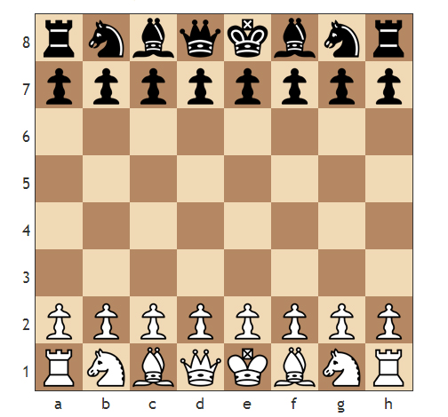
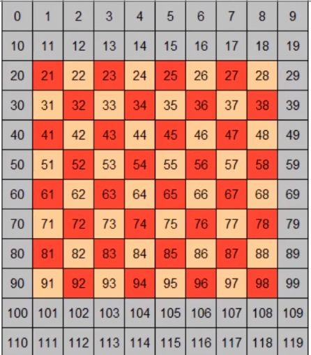
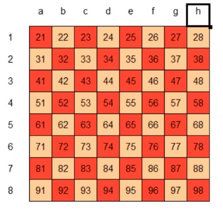
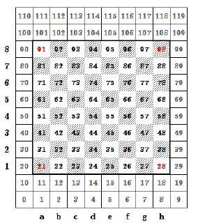
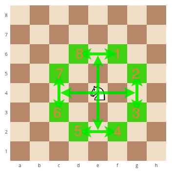

## Tugas Besar IF2111 Alstrukdat
Repo isinya tubes catur  IF2111.
Direktori dibagi jadi 2 di src ada engine sama adt. Adt isinya adt yang dibuat di kelas, kalau engine code yang mau kita buat di engine chessnya.


### PERHATIAN UNTUK PEMAKAIAN GIT ( Ribet Ternyata :( )
Karena ukuran projek ini lumayan dan kita ada berempat **sangat disarankan** agar saat kita ngoding untuk membuat **branch**. Caranya gimana?? [Tutorial Branch](https://github.com/Kunena/Kunena-Forum/wiki/Create-a-new-branch-with-git-and-manage-branches).
Yang perlu diperhatikan:
1. Buat nama branch sesuai nama kalian. Contoh bikin branch namanya Abbel
```bash
git checkout -b Abbel
```
2. Push ke githubnya ke branch kalian aja ya nanti kalau mau dimerge bilang bilang dulu
3. Update `README.md` di branch `master`

### Progress branch `main`
* Baru beresin definisi board
* Baru beresin definisi bidak
* ADT minus mesinkata
   

### Pembagian Gawe
* Board di file `board.h` : **Abbel** 
  * Beresin definisi board sama kondisi
* Bidak di file `bidak.h` : **Abbel**
  * Beresin definisi bidak buat di linked-list
  * Buat algoritma move-generation tiap bidak
* Cara bergerak bidak di board :
  * Move : **Abbel**
    * Implement algoritma move-generation
  * Special Move : **Vito**
    * Implement algoritma move-generation
* Linked list buat info bidak : **Abbel**
  * Bikin konstruktor listnya
* Stack buat undo : **Yumna**
  * Fixin data struct nya
  * Buat konstruktor stack buat implementasi undo
* Queue buat giliran : **Shafa**
  * Fixin data struct nya
  * Buat konstruktor queue
* Parsing file sama state game : **Vito**
  * Pikirin state game isinya apa aja
  * Algoritma parsing file ke state-game
  * Tambahin adt mesin kata kesini


### Board Representation
Aslinya board tuh gini:\
\
Ya jadi kita akan pakai representasi board dengan array ukuran 10*12. Jadi arraynya ada 120 tapi yang dipake cuman 64 biji, kira kira kaya gini:\
\
Ya bisa diliat ya itu jadi kita mulainya dari 21 makanya kita buat enum dari 21 yaitu A1 untuk nandain si papannya. Kira kira gini bray:\
\
Gunanya buat apa itu *teh*? Sebenernya mah buat penanda aja biar algoritma kita bisa nemu kalau ternyata papannya off-board gitu.
Nah nanti setiap *tile* tuh bakal diisi sama integer yang merepresentasikan si kondisi benerannya di papan catur.

### Tipe-tipe bentukan
#### Board
Belum fix ya sangat mungkin ditambah lagi terutama mengenai kondisi kondisi spesial contohnya skak dan special moves
```c
typedef struct {
    TabInt Tabel; //Table of int[120]
    boolean is_checkmate; //special for the king
    boolean is_en_passant; //special for the pawn
    boolean is_castling;
    booolean is_promosi;
}BOARD;
```
#### Bidak (buat Linked List)
Belum fix juga bisa ditambahin apa aja terutama saat udah implement linked-list
```c
typedef struct{
    PAWN_TYPE tipe;
    BOARD_SQUARES posisi;
    //bisa diisi apa aja
}BIDAK;
````
#### Move (hasil generate sama buat Stack juga)
Ini sebenernya move tuh buat hasil generate biasa tapi juga bisa dijadiin elemen stack tinggal di typedef aja sih
```c
 typedef struct{
      BOARD_SQUARE prev_position;
      BOARD_SQUARE now_position;
      boolean is_makan;
 }MOVE;
```
#### Queue 
Kerjaan shafa
#### State Game (buat load pake mesin kata)
Nah ini kerjaan vito buat mikirin state tuh isinya apa aja

### Move Mechanism
Ya karena kita memakai board 12*10 ada beberapa peraturan yang harus ditaati. Kira kira board nya kaya gini nanti: \
\
Ya kan pas sliding bidaknya tuh ada yang :
1. Up 
2. Down
3. Left
4. Right
5. Serong Kanan Atas
6. Serong Kiri Atas
7. Serong Kanan Bawah
8. Serong Kiri Bawah\
Oiya kita definisiin atas,bawah, dkk nya itu dari perspektif si pemain putih ya. Pemain hitam menyesuaikan. Nah jadi, bisa keliatan dari pola di board bahwa bergeraknya tuh:
```
    1. Up = Posisi Awal + 10
    2. Down = Posisi Awal - 10
    3. Left = Posisi Awal - 1
    4. Right = Posisi Awal + 1
    5. Serong Kanan Atas = Posisi Awal + 11
    6. Serong Kiri Atas = Posisi Awal + 9
    7. Serong Kanan Bawah = Posisi Awal - 9
    8. Serong Kiri Bawah = Posisi Awal - 11
```
Nah ada lagi yang unik yaitu untuk kuda sebenernya turunan dari yang atas juga sih, jadi gini gambarnya: \
\
Kuda tuh kan punya 8 kemungkinan:
```
1. Knight1 = Posisi awal + 21
2. Knight2 = Posisi awal + 12
3. Knight3 = Posisi awal - 8
4. Knight4 = Posisi awal - 19
5. Knight5 = Posisi awal - 21
6. Knight6 = Posisi awal - 12
7. Knight7 = Posisi awal + 8
8. Knight8 = Posisi awal + 19 

```

### Basic Mechanism for Move-Generation
1. Jadi kita punya board yang direpresentasikan sebagai array[120] of elemen.
2. Nah setiap array ini isinya integer yang merepresentasikan objek yang sebenarnya yang ada di setiap *tile* catur.
3. Kita juga punya linked-list yang isinya adalah setiap bidak yang ada di papan catur *which is* jumlahnya adalah 16 node yang artinya total ada 2 list.
4. State awalnya adalah setiap giliran tuh memiliki kondisi yang spesifik di arraynya untuk *representing* kondisi aktual tentang posisi, nah linked list tuh merepresentasikan setiap bidak yang isinya ada jenis bidak dan posisi:
   ```c
    typedef struct{
    PAWN_TYPE tipe;
    BOARD_SQUARES posisi;
    }BIDAK;
   ```
    Nah isi dari linked-list ini kita akan pakai untuk meng-generate possible move dari setiap bidak (node linked-list)
5. Ide umum generate move:
   1. Kita generate semua move dari setiap bidak spesifik sesuai aturan catur kita panggil aja **Illegal-move** dengan cara mengiterasi setiap node nanti akan dihasilkan sekumpulan opsi, termasuk makan memakan juga.
   2. Setelah itu akan difiliter move itu dengan melihat kondisi aktual yang ada di array, seperti apakah *tile* yang akan dituju legal atau engga (ga masuk *bad_square*) apakah di tile yang dituju ada isinya atau engga, apakah mungkin juga di *tile* yang dituju ada yang bisa dimakan atau engga. Intinya kita akan saring dari illegal-move buat nyampe pada *tile* yang isinya '0' atau lawan. Kita sebut saja setelah disaring namanya **Legal-move**

6. Nah algoritma umum untuk move-generation:
   1. Iterasi awal **(pre_move)** setiap node di linked-list 
   2. Generate **Illegal move** dari setiap node, dengan ketentuan:
      1. Posisi yang mungkin untuk berpindah
      2. atau posisi yang mungkin untuk makan (terutama buat pion karena makan sama geraknya beda)
   3. Filter **Illegal move** dengan ketentuan:
      1. Eliminasi Kalau *tile* tujuan *bad_square* 
      2. Eliminasi kalau *tile* tujuan isinya kawan
      3. Eliminasi kalau *tile* tujuan terpotong (kecuali kuda) oleh apapun
   4. Didapatlah **Legal move** dengan ketentuan:
      1. Aksi berpindah
      2. Aksi makan (spesifik sesuai ketentuan tiap bidak)
   5. User *prompt* input
   6. Eksekusi aksi dengan ketentuan:
      1. Posisi yang digerakan berubah (kondisi array berubah)
      2. Kalau makan lawan, artinya ada kondisi satu elemen array yang *ditimpa* jadi nanti akan dicheck setelah ini 
      3. Setelah aksi dilakukan kita push ke stack untuk ngisi mengenai info move baru aja dilakukan dengan isi stack
      ```c
      typedef struct{
          BOARD_SQUARE prev_position;
          BOARD_SQUARE now_position;
          boolean is_makan;
      }ELEMEN_STACK;
      ```
   7. Iterasi akhir **post_move**, dengan ketentuan:
      1. Check di setiap posisi bidak (BIDAK.POSISI yang belum dialter) yang ada di linked-list apakah sesuai dengan kondisi yang ada di elemen array atau engga
      2. Kalau ga sesuai, ada dua kemungkinan: *kosong* atau *ditimpa* oleh lawannya
      3. Nanti info yang masuk ke stack, dipake buat nge-update node bidak yang di linked-list
   8. Kalau dia dimakan, node yang berkesesuaian di dealokasi dan score pemain lawan ditambah
   9. Algoritma bakal menghasilkan list of move yang diperuntukkan untuk setiap list of bidak yang ada. Jadi fungsi move ini argumennya itu list of bidak yang bakal diiterasi satu-satu
    

### Algoritma generate move untuk setiap bidak
#### **Pion**
    


